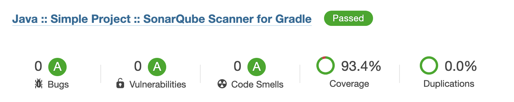

# fizzbuzz

## Summary

- [The statement](#The-statement)
- [Run it](#Run-it)
- [Details](#Details)
- [Test](#Test)
- [Code quality result](#Code-quality-result)
- [Endpoints](#Endpoints)

## The statement

The original fizz-buzz consists in writing all numbers from 1 to 100, and just replacing all multiples of 3 by “fizz”, all multiples of 5 by “buzz”, and all multiples of 15 by “fizzbuzz”. The output would look like this: “1,2,fizz,4,buzz,fizz,7,8,fizz,buzz,11,fizz,13,14,fizzbuzz,16,...”.

Your goal is to implement a web server that will expose a REST API endpoint that:
- Accepts five parameters : three integers int1, int2 and limit, and two strings str1 and str2.
- Returns a list of strings with numbers from 1 to limit, where: all multiples of int1 are replaced by str1, all multiples of int2 are replaced by str2, all multiples of int1 and int2 are replaced by str1str2.

The server needs to be:
- Ready for production
- Easy to maintain by other developers

Add a statistics endpoint allowing users to know what the most frequent request has been. This endpoint should:
- Accept no parameter
- Return the parameters corresponding to the most used request, as well as the number of hits for this request

## Run it
 
### With Docker :

#### Prerequisites

```bash
Docker
Docker-compose
```

#### Command line

```bash
docker-compose up
```

### With Java and Gradle

#### Prerequisites

| Software | Version |
| -------- | ------- |
| Gradle   | 5       |
| JAVA     | 11      |

#### Command line

```bash
# Compilation
./gradlew clean build

# Run
./gradlew bootRun

## SonarQube report with code coverage
./gradlew clean build jacocoTestReport sonarqube 
```

## Details

- This application is a Java SpringBoot Jar.
- Statistics data are stored in an embedded H2 database (easy to change in application.yam to switch to remote database)
- I use [Spring Security](https://spring.io/projects/spring-security) to configure HttpSecurity and CORS configuration
- I use [Spring JDBC](https://www.baeldung.com/spring-jdbc-jdbctemplate) to manage the database storage
- I use [Lombok](https://projectlombok.org/) to avoid repetitive Code
- I use [SonarQube](https://www.sonarqube.org/) to check the code quality with [Jacoco](https://www.jacoco.org/jacoco/trunk/index.html) for code coverage

## Test

Two types of tests are done in this project :
- Unit tests for service and Utils classes (GameServiceImplTest, StatisticServiceImplTest, CheckUtil)
- Integration tests which starts springboot server and only mocks the repository (FizzbuzzApplicationTests)

## Code quality result



## Endpoints

```bash
Header 
Accept-language:fr --> french error message
Accept-language:en --> english error message ( by default)

Get method to play FizzBuzz
http://localhost:8080/api/1/fizzbuzz?int1=3&int2=5&limit=150&str1=fizz&str2=buzz

Get method to display top statistic
http://localhost:8080/api/1/oneTopStatistic
```
